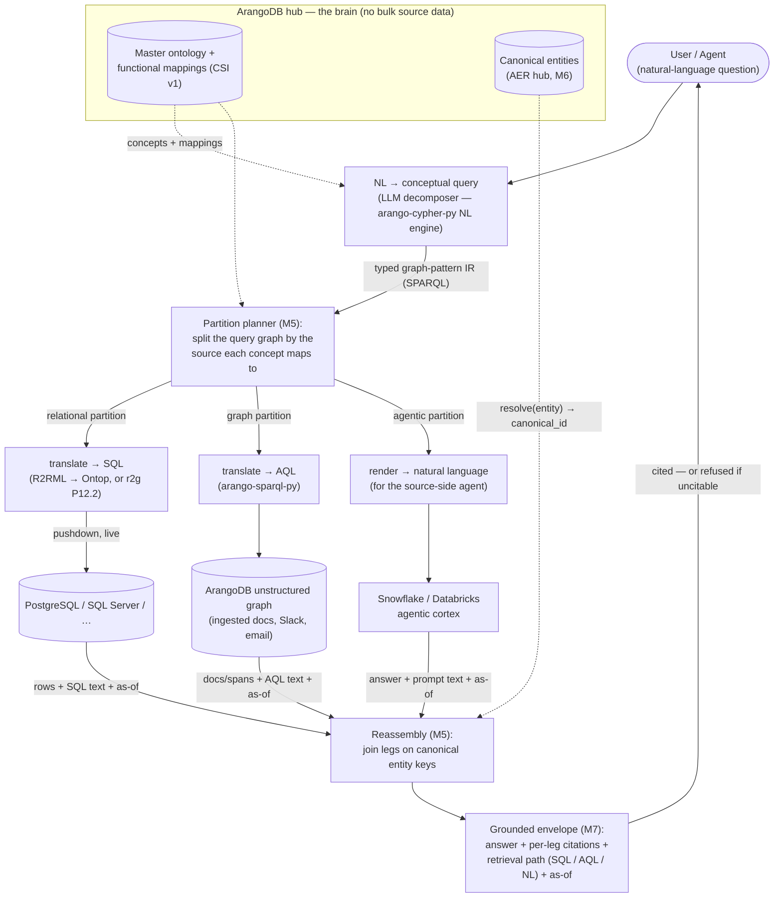
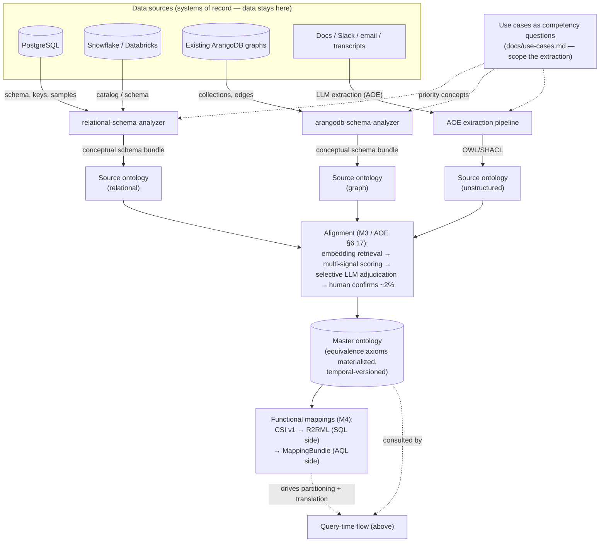

# Contextual Data Fabric

ArangoDB as an **ontology-based metadata / agent-brain hub**: auto-derive a use-case-driven ontology across structured + unstructured sources, and answer English questions by **federating queries across systems** — grounded and cited — **without moving the data**.

Part of **Project Vantage**. Built for and pressure-tested against the the design partner customer-context engagement.

> **Status (2026-08-06):** P1 and the recommended P2/P3 code sequence are
> complete: 20/20 work packages and 7/7 executable implementation gates. The
> repo ships `POST /federate`, semantic MCP, four live source adapters
> (Ontop/Postgres, Snowflake, ClickHouse, and ArangoDB), governed NL routing,
> cost-aware planning, bounded virtual/assembled execution, answer-level
> provenance, runtime-resolution seams, secret rotation, OIDC and OpenFGA-
> compatible policy contracts, an authoritative M11 catalog manifest, the
> browser demo, and executable evidence suites.
>
> This is **not a production-readiness or SOTA claim**. Production OpenFGA,
> IdP/STS/delegation, source-native policy, a released AER integration, public
> scale/bakeoff evidence, and materially better external NL accuracy remain.
> The project and SOTA scorecards below define the exact evidence boundaries.

## Start here

- **[PRD](docs/contextual-data-fabric-prd.md)** — the near-term contract: vision → phased plan → **detailed Phase 1** (1-week federated-query goal) → referenced repos → open decisions → cross-cutting requirements (§10).
- **[North Star](docs/contextual-data-fabric-north-star.md)** — the end-state vision every phase ladders toward. The horizon to check scope against.
- **[Use Cases & Competency Questions](docs/use-cases.md)** — personas, interaction model, and the CQ table derived from the 12 locked questions (Q2 proposed for the P1 demo).
- **[Architecture Index](docs/architecture/README.md)** — the "super-module":
  module map, module→repo dependencies, phase status, and current dependency
  integration/pinning gaps.
- **[Project Scorecard](docs/architecture/project-scorecard.md)** — implementation-gate status and remaining production evidence.
- **[SOTA Scorecard](docs/architecture/project-sota-scorecard.md)** — weighted, competitor-relative evidence levels and promotion gates.
- **[ADR-0001 — Conceptual-query language](docs/architecture/module-05-federated-query-engine/adr/ADR-0001-conceptual-query-language.md)** + **[M5 implementation plan](docs/architecture/module-05-federated-query-engine/implementation-plan.md)** — the decided query architecture and the sequenced work packages (incl. the honest 1-week P1 slice).
- **[ADR-0004 — Identity planes and policy enforcement](docs/architecture/module-05-federated-query-engine/adr/ADR-0004-identity-planes-and-policy-enforcement.md)** — the P3 asker/query identity, request-context, delegation, and future ReBAC enforcement decision.
- **[Phase-1 deployment topology](docs/architecture/deployment-p1.md)** — what physically runs where for the demo (build-time vs demo-time split).
- **[Running the demo](deploy/README.md)** — prerequisites, `make install &&
  make demo`, all four live source kinds, example questions, evidence
  boundaries, and troubleshooting. The full demo/gate requires configured
  Snowflake loader and query credentials.

## Semantic MCP agent surface

Install the optional MCP v2 dependency and run the local stdio server:

```bash
python -m pip install -e ".[mcp]"
cdf-mcp
```

Configure the process with the same `CDF_*`, source, and NL environment variables
as the HTTP service. The tools are intentionally semantic: `federate(question,
allow_partial=False)` calls the same `FederationService.federate_question` path as
`POST /federate`; `list_sources`, `list_concepts`, and `nl_preview` expose safe
catalog/planning metadata. There are no raw SQL, AQL, or credential tools.

For example, an MCP host can launch:

```json
{
  "command": "/absolute/path/to/contextual-data-fabric/.venv/bin/cdf-mcp",
  "env": {
    "CDF_CSI_DIR": "/absolute/path/to/contextual-data-fabric/deploy/csi",
    "CDF_R2RML_DIR": "/absolute/path/to/contextual-data-fabric/deploy/r2rml"
  }
}
```

`create_mcp_server(service_factory=...)` is the injection seam for tests and
alternative wiring. Stdio is secured by the launching process, not bearer
headers. For a deployed Streamable HTTP server, the current MCP SDK provides the
supported OAuth 2.1 resource-server hook: pass its `TokenVerifier` and
`AuthSettings` together as `token_verifier=` and `auth=`, then call
`server.run(transport="streamable-http", ...)`. Do not expose unauthenticated
HTTP or implement ad-hoc static-token parsing; token issuance remains with the
deployment's authorization server.

MCP v2 authenticated HTTP tools map the SDK's official `get_access_token()`
context into the same immutable, bearer-free CDF `RequestContext` used by HTTP.
Set `auth_required=True` to refuse tools without an authenticated subject;
stdio/tests may inject a context factory. Source, concept, property, and
relationship introspection is filtered through the same catalog/OpenFGA-
compatible policy decision point as query execution.

Runtime entity resolution is optional and catalog-bound. A deployment that
enables a source's `runtimeResolution.mode: canonical_hub` must inject a
CDF-compatible guarded resolver directly, or set
`CDF_ENTITY_RESOLVER_FACTORY=package.module:function`; the factory receives the
environment mapping and returns the resolver. Call, batch, and deadline caps use
`CDF_MAX_RESOLUTION_CALLS`, `CDF_RESOLUTION_BATCH_SIZE`, and
`CDF_RESOLUTION_DEADLINE_MS`. CDF does not install or claim a released AER API;
the checked-in demo manifest keeps all sources at `mode: none`.

## How it works

Two flows share versioned semantic and mapping artifacts. Query time is
implemented in this repository. The broader automated build-time alignment flow
is the cross-repository target architecture described below.

### Query time — from English to a cited, federated answer

A natural-language question is lifted into a **conceptual query**—a typed graph
pattern serialized as SPARQL ([ADR-0001](docs/architecture/module-05-federated-query-engine/adr/ADR-0001-conceptual-query-language.md)).
The planner partitions it by concept ownership and compiles each partition to
SQL or AQL. Results are joined on declared canonical keys; deployments may
additionally inject the guarded M6/AER runtime resolver. The checked-in demo
uses deterministic shared account IDs and keeps runtime resolution disabled.
M7 returns a grounded envelope with answer/leg-level citations: conceptual and
native queries, source objects, row counts, and as-of timestamps—or a clean
refusal when the answer cannot be supported. Field-level derivation lineage
remains a SOTA evidence gap.

Source **credentials never travel with any of this**: mappings, citations, and the hub reference sources by logical name only; the connector layer (M1) resolves names to credentials at connection time from a secret store. Existing/demo sources use one least-privilege read-only service identity. A P3 delegated-mode protocol now fails closed unless an external broker and context-aware adapter are supplied; this repo does not provision the STS or source policy.
Production Docker/Kubernetes deployments use the mounted-file
`SecretResolver`; generation changes atomically rotate executors after in-flight
calls finish. See the [deployment secret runbook](deploy/README.md#production-connector-secrets-and-rotation).



> **Shipped vs. north-star (the `agentic partition` lane).** Today's Snowflake leg takes **SQL directly** — a native `SnowflakeExecutor` (SPARQL→SQL, compiled from the same R2RML), *not* the render-to-NL cortex path — per [ADR-0002](docs/architecture/module-05-federated-query-engine/adr/ADR-0002-snowflake-cortex-agentic-legs.md). The `render → natural language` / `Snowflake / Databricks agentic cortex` lane above is the **general design** for sources that expose *only* an agent (Cortex Analyst, Databricks Genie); it's supported in principle and built on customer demand, and never sits on the deterministic gate path.

### Build time — target architecture for deriving and aligning source ontologies

The checked-in demo consumes versioned CSI/R2RML and catalog artifacts. The
broader automated extraction, alignment, human-review, and temporal belief-
revision flow below spans owned repositories and remains the North Star; it is
not claimed as an end-to-end implementation in this checkout.

Each source's **schema** is analyzed into a **source ontology**: relational schemas via `relational-schema-analyzer` (tables, keys, FKs → concepts/properties), existing ArangoDB graphs via `arangodb-schema-analyzer`, and unstructured corpora via AOE's LLM extraction pipeline — all scoped by the **competency questions** in [use-cases.md](docs/use-cases.md) (extract what the questions need, never boil the ocean). The per-source ontologies are then **aligned** (M3, AOE §6.17): embedding retrieval proposes cross-source correspondences, multi-signal scoring auto-resolves the clear cases, an LLM adjudicates only the borderline band, and a human confirms the last ~2%. The result is the **master ontology** — `customer account` ≡ `client account` ≡ `account`, with equivalence axioms materialized — plus the **functional mappings** (CSI v1, exported as R2RML for SQL and MappingBundle for AQL) that make the query-time partitioning and translation deterministic. The ontology is temporal-versioned: source changes cascade through belief revision rather than rebuilding.

Three practicalities that matter at enterprise scale:

- **Purpose-scoped table selection.** Real warehouses have thousands of tables; introspecting everything is wrong. An integration declares its **purpose** (an ORSD-style statement + competency questions — e.g. "a Customer 360 view"), and the extractor **ranks tables by relevance before introspecting**: purpose-term similarity against table/column names and their catalog comments, foreign-key-neighborhood expansion from seed tables, the warehouse's own **query/access history** (the tables an org actually queries are the relevant ones), and governance tags as include/exclude policy. A curator confirms the ranked set — the "automation proposes, human confirms ~2%" pattern applied to table selection (M2 FR-5a; schema-analyzers RE-6).
- **Keys are read where declared, inferred where not.** Cloud warehouses (Snowflake among them) accept primary/foreign-key *declarations* without enforcing them — and many schemas declare nothing. Declared keys are read from the catalog (they're documentation-grade metadata even when unenforced); undeclared keys are **inferred** — name-convention heuristics propose candidates, bounded **value-overlap sampling** confirms them statistically — and inferred keys carry confidence into the same human-confirm step (schema-analyzers RE-7 tracks the per-warehouse sampler coverage).
- **The source's catalog is an input, never re-described.** Whatever the source already knows — `INFORMATION_SCHEMA`, object comments, governance tags, lineage/usage views, or an external enterprise catalog (OpenMetadata-class, via r2g's catalog providers) — feeds extraction directly; customers are never asked to restate it.



## Modules

| # | Module | Spec |
|---|--------|------|
| M1 | Connectors | [spec](docs/architecture/module-01-connectors/specification.md) |
| M2 | Ontology Extraction | [spec](docs/architecture/module-02-ontology-extraction/specification.md) |
| M3 | Ontology Alignment | [spec](docs/architecture/module-03-ontology-alignment/specification.md) |
| M4 | Mapping Layer | [spec](docs/architecture/module-04-mapping-layer/specification.md) |
| M5 | Federated Query Engine | [spec](docs/architecture/module-05-federated-query-engine/specification.md) · [ADR-0001](docs/architecture/module-05-federated-query-engine/adr/ADR-0001-conceptual-query-language.md) · [plan](docs/architecture/module-05-federated-query-engine/implementation-plan.md) |
| M6 | Entity Resolution / Canonical Hub | [spec](docs/architecture/module-06-entity-resolution/specification.md) |
| M7 | Grounding & Provenance | [spec](docs/architecture/module-07-grounding-provenance/specification.md) |
| M8 | Governance / OBAC | [spec](docs/architecture/module-08-governance-obac/specification.md) |
| M9 | Demo Harness | [spec](docs/architecture/module-09-demo-harness/specification.md) |
| M10 | Evaluation & Golden Set | [spec](docs/architecture/module-10-evaluation/specification.md) |
| M11 | Authoritative Fabric Catalog | [ADR-0003](docs/architecture/module-05-federated-query-engine/adr/ADR-0003-authoritative-catalog-manifest.md) |

## Enhancement specs for existing repos

Requirement specs telling each existing Arango repo what it must add to serve the fabric:

- **r2g → federated query** — [spec](docs/architecture/_repo-enhancements/r2g-federated-query.md)
- **ontology-extractor → structured input + alignment/belief APIs** — [spec](docs/architecture/_repo-enhancements/ontology-extractor-structured.md)
- **AER → semantic + federation-aware ER** — [spec](docs/architecture/_repo-enhancements/aer-semantic-federated.md)
- **schema-analyzers → metadata sampling** — [spec](docs/architecture/_repo-enhancements/schema-analyzers-metadata-sampling.md)
- **customer-context → expose graph, grounding envelope & ontology-driven AQL** — [spec](docs/architecture/_repo-enhancements/customer-context-expose-modules.md)

## Phase 1 acceptance target (completed)

The original target was a federated query across one live relational database
and ArangoDB, grounded and cited without mirroring source data. It is complete
and has expanded to four source kinds and a 15-case hosted live contract gate.
See the [project scorecard](docs/architecture/project-scorecard.md) for current
evidence and [PRD §7](docs/contextual-data-fabric-prd.md) for the historical work
breakdown.

## Authoring new specs

Copy [`docs/architecture/_TEMPLATE-module-spec.md`](docs/architecture/_TEMPLATE-module-spec.md), fill it in, and reconcile it against the [Architecture Index](docs/architecture/README.md). PR per sub-module.

---

*Some docs use Obsidian `[[wikilink]]` syntax (authored in a vault). They render as plain text on GitHub; the links above are the GitHub-navigable index.*
