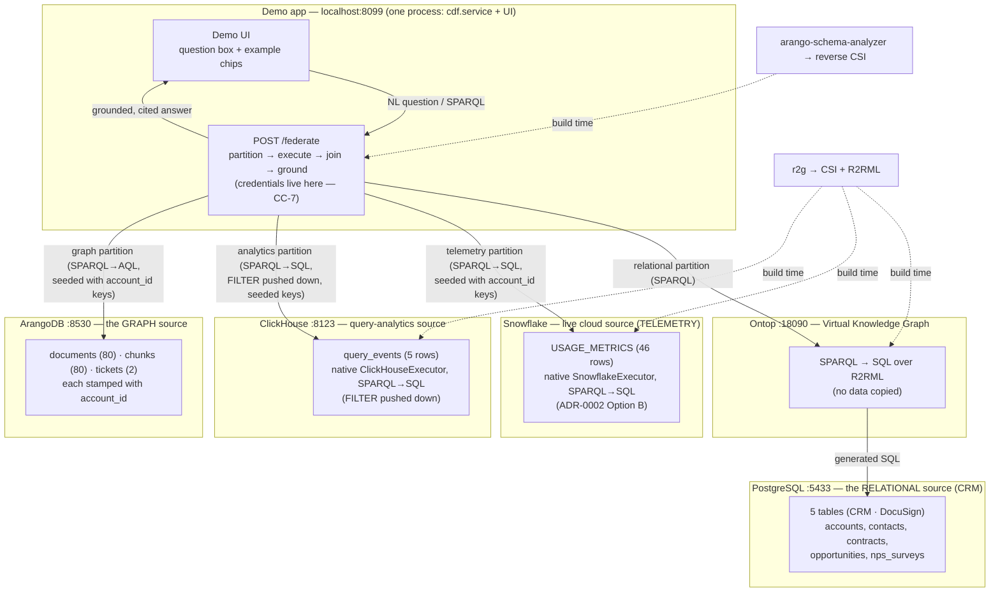

# Running the demo

The Contextual Data Fabric demo answers one conceptual question by **federating
four live sources** — Postgres (CRM), Snowflake (usage telemetry), ClickHouse
(query analytics), and ArangoDB (documents)—joining their results on a shared
business key and returning answer/leg-level citations, **without moving source
data into the fabric**.

> **What this proves:** the query-time architecture over checked-in/generated
> mapping artifacts—cross-source decomposition (incl. single-leg FILTER/OPTIONAL
> pushdown), a deterministic join, grounded citations, and honest refusals. It is
> an **internal / team** demo of the machinery across four live engines.

## Quick start

Prerequisites: **Docker Desktop running**, Python 3.10+, and a gitignored `.env`
containing Snowflake loader and read-only query credentials. `make install`
installs the reviewed `arango-sparql-py` commit in
`deploy/pins/arango-sparql-py.txt`; developers can explicitly opt into an
editable sibling with `CDF_USE_LOCAL_SIBLINGS=1`. The merge-blocking
three-local-engine path does not require Snowflake, but `make seed`, `make gate`,
and `make demo` run the full four-engine path.

```bash
cd ~/code/contextual-data-fabric
make install        # once: create .venv, install engine + live-leg libraries
make demo           # bring up stacks, load data, run the gate, serve the UI
```

Then open **http://localhost:8099**, type a question (or click an example
chip), and hit **Ask**. `Ctrl+C` stops the web server; the databases keep
running (`make down` stops them, preserving data).

| Command | What it does |
|---------|--------------|
| `make install` | Create `.venv`, install the engine + live-leg libraries. Run once. |
| `make demo` | `up` → `seed` → `gate` → clear port 8099 → serve the browser UI. |
| `make gate` | Run all 15 live contracts against four engines (the mandatory pre-demo check). Two cases assert exact bindings; the remainder assert routing, reconciliation, grounding, or refusal behavior. |
| `make up` / `make down` | Start / stop the local Docker stacks — Postgres+Ontop, ArangoDB, and ClickHouse (data preserved on `down`; ClickHouse self-seeds on first create). Snowflake is a live cloud source loaded by `make seed`. |
| `make seed` | (Re)load the source databases (Postgres, Snowflake, ArangoDB) + emit the mappings. |
| `make test` | Catalog integrity, authorization, lint, types, and the unit/contract suite. CI additionally runs live source jobs. |

## Topology — what runs where

The local stacks run on one machine; Snowflake is a live cloud source.
**Five local processes** — the demo app (engine **and** UI in one, on :8099),
Postgres, Ontop, ArangoDB, and ClickHouse — plus **one live cloud leg**
(Snowflake) and one build-time step. The databases are the systems of record; the
fabric holds only the mappings and the join — it never copies their data.



**The join:** the relational leg returns `account_id`; the engine pushes those
keys into the graph leg as a `VALUES` clause (a bind-join), so ArangoDB only
returns rows for the accounts in play. `account_id` is baked into both sides by
construction — a deterministic, document-level join, no fuzzy matching at query
time.

## What's in each database

### PostgreSQL (`crm`) — the structured / relational source
The synthetic CRM + contracts corpus for three accounts (Northwind =
healthy expansion, Meridian = hidden risk, Helio = churn). Loaded by
`deploy/ontop/load_corpus.py` from `customer-context/data_gen/output/structured/`.
The usage telemetry now lives in the live Snowflake source (below), so it is no
longer a Postgres table.

| Table | Rows | Source system | Holds |
|-------|-----:|---------------|-------|
| `accounts` | 3 | CRM | account name, segment, product tier, health score, ARR, `account_id` |
| `contacts` | 8 | CRM | people, titles, champion role, engagement status |
| `opportunities` | 16 | CRM | pipeline stage, amount, renewal date |
| `nps_surveys` | 35 | CRM | NPS **scores** (the numbers; the verbatims live on the graph side) |
| `contracts` | 15 | DocuSign | value, term, auto-renew, product scope, days-to-renewal |

Ontop exposes these as a Virtual Knowledge Graph: it answers SPARQL by
rewriting to SQL against the live tables through the **r2g-generated R2RML**
mapping (`deploy/ontop/input/mapping.ttl`) — nothing is copied out of Postgres.

### Snowflake (`TELEMETRY`) — the live cloud telemetry source
The usage-telemetry half of the corpus, loaded into a live Snowflake trial
account by `deploy/snowflake/load_corpus.py`. Physical names land uppercase
(Snowflake's identifier folding); CC-12's naming layer maps them to the
conceptual vocabulary (`USAGE_METRICS` → `UsageMetric`).

| Table | Rows | Source system | Holds |
|-------|-----:|---------------|-------|
| `USAGE_METRICS` | 46 | Snowflake | query volume, cluster size, edition, feature adoption |

The `UsageMetric` concept routes **uniquely** to Snowflake — `usage_metrics` was
dropped from the Postgres mapping so the planner sees exactly one owner per
concept. The leg is a **native `SnowflakeExecutor`** (ADR-0002 "Option B"): it
compiles the SPARQL partition straight to Snowflake SQL over
`snowflake-connector-python` (no Ontop/JDBC), driven by the r2g-generated R2RML.

### ClickHouse (`analytics`) — the query-analytics source
Per-account query telemetry — the high-volume analytics workload ClickHouse is
built for. Self-seeded by the container's `docker-entrypoint-initdb.d` on first
create (`deploy/clickhouse/seed.sql`); no `make seed` step needed.

| Table | Rows | Holds |
|-------|-----:|-------|
| `query_events` | 5 | per-account query events: `feature`, `query_count`, `avg_latency_ms`, `event_date` |

The `QueryEvent` concept routes uniquely to ClickHouse. Ontop has no ClickHouse
dialect, so the leg is a **native `ClickHouseExecutor`**: it compiles the SPARQL
partition — **including a pushed-down E1 `FILTER`** (e.g. `avgLatencyMs < 25`
compiles to `WHERE avg_latency_ms < 25`) — straight to ClickHouse SQL, driven by
the r2g-generated R2RML.

### ArangoDB (`cmf`) — the unstructured / graph source
The document corpus (Slack, email, docs, Gong transcripts) for the same three
accounts. Loaded by `deploy/arango/load_corpus.py` from
`customer-context/data_gen/output/unstructured/`.

| Collection | Count | Holds |
|------------|------:|-------|
| `documents` | 80 | one per source file: `account_id`, source (slack/email/docs/gong), `citable_url`, role, `questions_served`, `event_date` |
| `chunks` | 80 | paragraph-bounded text, each carrying `document_id` **and** the denormalized `account_id` stamp |
| `tickets` | 2 | a small typed collection linked to two corpus accounts |

The `arango-sparql-py` transpiler answers SPARQL by generating AQL against
these collections, driven by the **analyzer-generated reverse CSI**
(`deploy/csi/arango-cmf.json`).

## The example questions

Shown as clickable chips in the UI (resolved from `deploy/questions.json`):

- **"for each account, what product tier are they on?"** — a **structured-only**
  question: answered entirely from Postgres. The trust-building anchor: clean,
  fully-sourced, single-leg.
- **"for each account, what documents do we hold and where did they come from?"**
  — a **cross-graph** question: joins the 3 Postgres accounts to their 80
  ArangoDB documents on `account_id`. This is the federation story — two
  databases, one answer, every row cited with its source URL.
- **"at each account's peak usage quarter, how is volume trending, and what do
  the signal documents say?"** — the **three-source flagship** (golden g5):
  joins `Account` (Postgres) ⋈ `UsageMetric` (Snowflake) ⋈ `Document` (ArangoDB)
  on `account_id`. One answer reconciled across a relational CRM, a live cloud
  warehouse, and a document graph — every leg cited with the exact SQL/AQL that
  ran.
- **"which query events stayed under 25 ms, and the document filenames if any?"**
  — the **pushdown showcase** (golden g7): joins `QueryEvent` (ClickHouse) ⋈
  `Document` (ArangoDB) on `account_id`, with the latency `FILTER` compiled into
  ClickHouse SQL (`WHERE avg_latency_ms < 25`) and the filename as an `OPTIONAL`.
  The E1 single-leg FILTER/OPTIONAL pushdown, live on a fourth engine. (Ask it in
  English via the NL front-end, or run the SPARQL in the Advanced box.)

The answer panel shows the status badge (`grounded` / `refused` / `partial`),
the per-source partition (the actual SQL and AQL that ran, source objects,
as-of timestamps, row counts), and the joined result.

## Production connector secrets and rotation

Local/demo deployments remain backward compatible with the flat
`ARANGO_*`, `CLICKHOUSE_DSN`, `SNOWFLAKE_*`, and
`ONTOP_SPARQL_ENDPOINT` environment variables. Production should mount a
names-only registry plus one JSON secret per logical source:

```bash
CDF_SECRET_BACKEND=file
CDF_SECRET_REGISTRY_PATH=/run/cdf-secrets/registry.json
CDF_SECRET_MOUNT_PATH=/run/cdf-secrets
CDF_SECRET_POLL_INTERVAL_SECONDS=5
CDF_STRICT_STARTUP=true
```

[`secrets/registry.example.json`](secrets/registry.example.json) contains only
logical source IDs and mounted filenames. Do not commit the referenced files.
Each referenced file must contain exactly:

```json
{
  "generation": "<opaque-rotation-alias>",
  "fields": {
    "<connector-field>": "<mounted-secret-value>"
  }
}
```

Mount both registry and secret documents as regular files owned by root or the
service user, with POSIX mode `0400` or `0600`. Change `generation` whenever
any field changes. The engine builds the replacement with the new fields,
atomically swaps it, permits calls already using the old executor to finish,
then drains the old pool. A failed replacement keeps the prior generation.
With strict startup enabled (also implied by `CDF_POLICY_REQUIRED=true`), every
catalog source must resolve connector configuration or startup fails with the
missing logical source IDs. Development mode may start partially configured;
`GET /health` then reports `status: degraded`, `unconfigured_sources`, and
value-free credential state. MCP `list_sources` exposes only policy-authorized
safe metadata.

Canonical fields are `url/database/user/password` for Arango,
`dsn` for ClickHouse, `account/user/password` or
`account/user/private_key_file[/private_key_file_pwd]` plus optional
`warehouse/database/schema/role` for Snowflake, and `endpoint` for Ontop.
Multiple sources of one kind use separate entries keyed by exact CSI
`source_id`. The optional assembly backend uses `cdf:assembly` with kind
`assembly` and Arango fields.

The Ontop endpoint is safe connector configuration; Ontop's Postgres/JDBC
credentials live in the separate Ontop process and must be mounted and rotated
there. LLM provider API keys are intentionally not accepted by this
source-connector registry.

## Query identity and policy (P3 WP-15/WP-17/WP-18)

Local HTTP, stdio MCP, and the demo remain backward compatible: authentication
is optional and an explicit `cdf:dev|anonymous` query principal is used. A
production composition should install `.[auth]`, construct an `OIDCVerifier`
with an exact issuer, audience, allowed algorithms, and HTTPS JWKS URI, and call
`create_app(..., verifier=verifier, auth_required=True)`. JWKS fetch timeouts,
cache lifetime, and key count are bounded. The deployment owns IdP
registration, claims, key rotation, and availability; CDF does not discover or
provision an IdP.

Accepted request headers are `Authorization: Bearer ...`, `X-Request-ID`,
`X-Trace-ID`, `X-CDF-Purpose`, and an absolute RFC 3339 `X-CDF-Deadline`.
Purpose is rejected unless the application supplies a purpose-policy callback.
Request IDs, purpose, tenant, and the issuer/subject principal key are safe
metadata; bearer tokens are verified at the edge and are never stored in
`RequestContext`, answers, telemetry, source contexts, or logs. Identity-like
body fields are rejected.

MCP Streamable HTTP continues to use the MCP v2 SDK's `TokenVerifier` and
`AuthSettings`; tools derive CDF context through the official
`get_access_token()` API. Stdio/tests can inject a context factory. Setting
`auth_required=True` makes every semantic tool refuse when no authenticated
subject/context exists. Catalog source/concept/property introspection and NL
preview now pass through the same PDP; unauthorized metadata is filtered or
refused. In auth-required HTTP mode, unauthenticated health exposes only
`{"status":"ok"}`.

Select policy composition explicitly:

- `CDF_POLICY_BACKEND=none` preserves local/legacy behavior and is rejected
  when `CDF_POLICY_REQUIRED=true`;
- `catalog` requires `CDF_CATALOG_MANIFEST` and applies its deterministic
  source/concept/property rules offline;
- `openfga` adds fail-closed relationship checks and requires explicit API URL,
  store ID, authorization model ID, and relationship. CDF does not provision
  those resources or synchronize tuples.

Service-mode row scoping and masking are denied unless the corresponding
manifest rule sets `allowFabricRowPushdown` or `allowFabricMasking`. Delegated
mode still receives fabric preflight, returned-row verification, and postflight
checks. HMAC masking requires `CDF_MASKING_KEY` or an injected
`CDF_MASKING_KEY_RESOLVER_FACTORY`; the key and OpenFGA bearer material are
opaque and excluded from envelopes/logging.

All checked-in demo sources remain `service` auth mode. Selecting `delegated`
without both an injected `DelegationBroker` and a context-aware source adapter
fails closed—there is no service-credential fallback. This repository does not
provide an RFC 8693 STS, Snowflake external-OAuth security integration,
Postgres impersonation roles, or source-native RLS/masking configuration. Do
not set delegated mode until those external dependencies are deployed and
tested.

## Query resource guardrails

The service accepts optional admission/runtime caps. Unset estimate/runtime
limits are disabled; seed safety remains enabled by default.

| Variable | Meaning | Default |
|----------|---------|---------|
| `CDF_MAX_ESTIMATED_ROWS` | Refuse when the planned final row estimate exceeds this value | unset |
| `CDF_MAX_ESTIMATED_BYTES` | Refuse when estimated source bytes exceed this value | unset |
| `CDF_MAX_ESTIMATED_COST_USD` | Refuse when a fully known estimated cost exceeds this value | unset |
| `CDF_RUNTIME_WALL_TIME_MS` | Declare a runtime refusal after this wall-clock budget | unset |
| `CDF_MAX_INTERMEDIATE_ROWS` | Refuse when an engine-side intermediate exceeds this size | unset |
| `CDF_MAX_FINAL_ROWS` | Refuse when the final result exceeds this size | unset |
| `CDF_SEED_BATCH_ROWS` | Maximum distinct bind keys in one `VALUES` call | `1000` |
| `CDF_MAX_SEED_ROWS` | Hard distinct-key ceiling across all seed batches | `10000` |
| `CDF_ALLOW_PARTIAL_ON_RUNTIME_CAP` | Permit explicitly requested partial final-row truncation | `false` |

CSI files may add the versioned `statistics` v1 block documented in the
[M5 specification](../docs/architecture/module-05-federated-query-engine/specification.md).
Malformed or negative statistics fail startup. Missing statistics remain valid
and use conservative estimates plus the legacy safe stage order.

### Opt-in assembled execution

`POST /federate` and MCP `federate` accept
`"execution_mode": "virtual" | "assembled"`. The default is `virtual`, so
existing requests and answers are unchanged. `assembled` is disabled unless
the deployment explicitly sets `CDF_ASSEMBLY_ENABLED=true` and configures an
Arango backend:

| Variable | Meaning | Default |
|----------|---------|---------|
| `CDF_ASSEMBLY_ENABLED` | Permit explicitly requested assembled jobs | `false` |
| `CDF_ASSEMBLY_ARANGO_URL` | Legacy-env temporary-graph Arango URL; may fall back to `ARANGO_URL` | unset |
| `CDF_ASSEMBLY_ARANGO_DATABASE` | Legacy-env temporary-graph database; may fall back to `ARANGO_DB` | `cmf` |
| `CDF_ASSEMBLY_ARANGO_USER` / `_PASSWORD` | Legacy-env backend credentials; production file backend uses `cdf:assembly` | existing Arango values |
| `CDF_ASSEMBLY_MAX_ROWS` | Hard total source + joined-intermediate vertex cap | `50000` |
| `CDF_ASSEMBLY_MAX_BYTES` | Hard serialized temporary-payload cap | `67108864` |
| `CDF_ASSEMBLY_WALL_TIME_MS` | Hard assembled-job wall-time budget | `30000` |
| `CDF_ASSEMBLY_TTL_SECONDS` | Crash-fallback expiry on temporary vertices/edges | `300` |

An assembled request requires validated CSI statistics for every leg and is
refused if its preflight estimate is unknown or over budget. Each admitted run
uses an unpredictable job ID and isolated temporary named graph plus vertex and
edge collections. Source rows and deterministic joined intermediates are stored
with lineage; derived rows link to their direct inputs. Cleanup runs on every
outcome, and TTL indexes are a crash fallback. Cleanup failures are returned as
structured refusals.

The temporary graph is the bounded intermediate/lineage substrate. The
answer-producing table-binding join intentionally remains the existing
deterministic Python join; WP-12 does not translate arbitrary joins to AQL where
semantic parity would be weaker.

## Limitations (what this demo does *not* yet show)

- **Free-form English.** The LLM NL front-end **is implemented and wired**
  (`src/cdf/query/nl.py` + `POST /nl-preview`): `from_env` enables it whenever an
  API key is present (`OPENAI_API_KEY` / `ANTHROPIC_API_KEY` / `NL2SPARQL_API_KEY`
  — one is set in `.env`), so `make demo` runs with free-form NL **active**. It is
  pinned **off** only in the deterministic `make gate` (`CDF_NL_DISABLED`), where
  every leg must be reproducible. Without a key it falls back to the fixed
  registry of questions (the M9 "pre-run" mode), where an unlisted question
  **refuses honestly** rather than guessing.
- **Document sentiment / entity extraction.** Documents are loaded as citable
  text, but their *sentiment/entities* are not extracted. The former "green
  metrics, red sentiment" centerpiece question (Q12), which needed that
  extraction, was **dropped 2026-08-04**; the demo's cross-source risk story is
  now carried by Q2 (renewal risk + WHY) over the loaded documents.

## Troubleshooting

| Symptom | Fix |
|---------|-----|
| `No rule to make target 'demo'` | You're in the wrong directory — `cd ~/code/contextual-data-fabric` (not `customer-context`). |
| `address already in use` on :8099 | A previous UI is still running. `make demo` now clears it automatically; or run `make free-ui`. |
| A leg shows `failed` in the answer | That stack is down — `make up`, then retry. (The engine *declares* the failed leg rather than hiding it — that's the intended behavior.) |
| Ports clash with other local containers | Override, e.g. `make demo CDF_ARANGO_PORT=8531 CDF_POSTGRES_PORT=5434 CDF_ONTOP_PORT=8091`. |

See also the per-stack notes in [`ontop/README.md`](ontop/README.md) and
[`arango/README.md`](arango/README.md), and the architecture-level
[deployment topology](../docs/architecture/deployment-p1.md).
