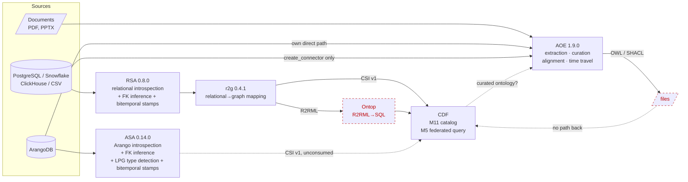
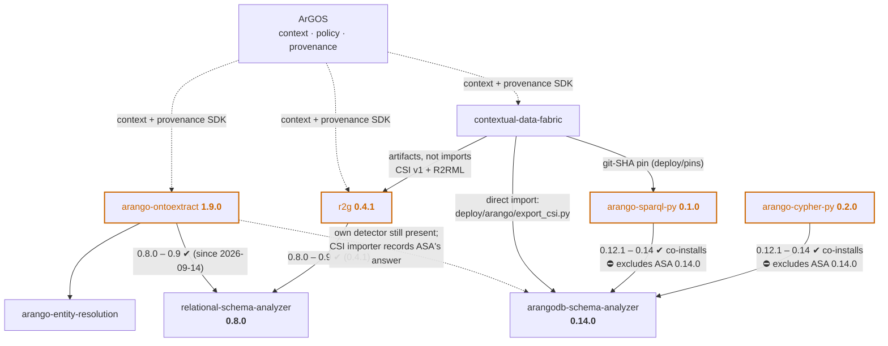
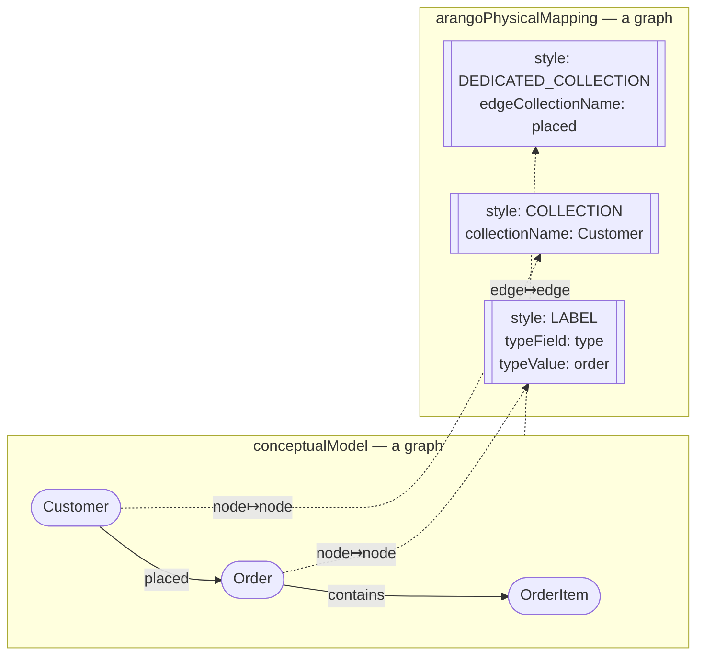
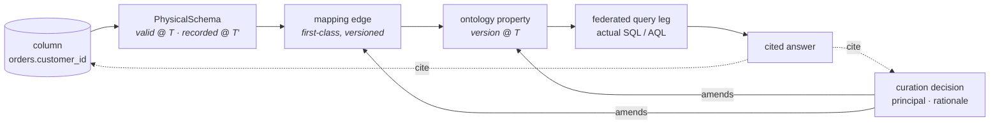
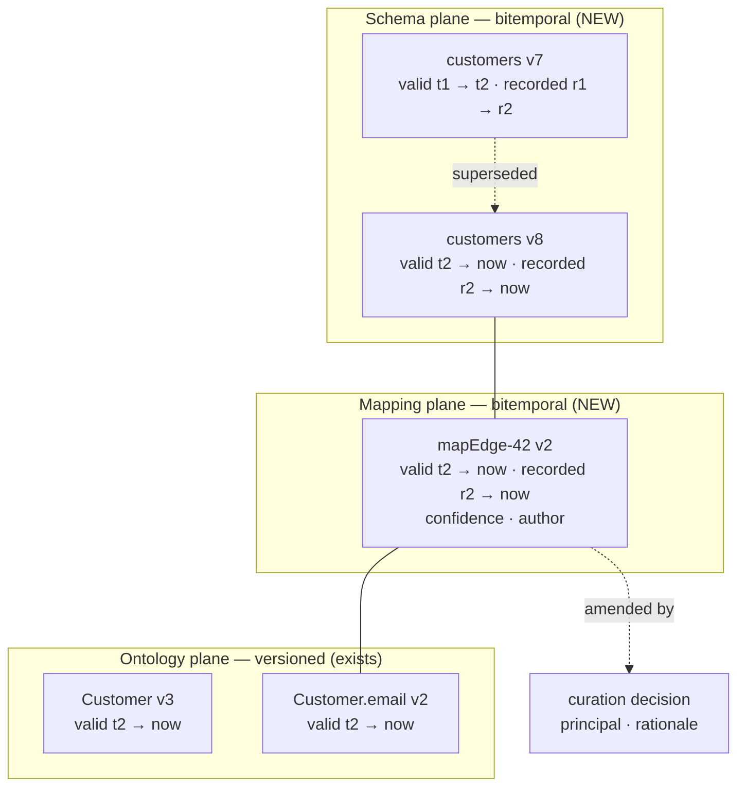
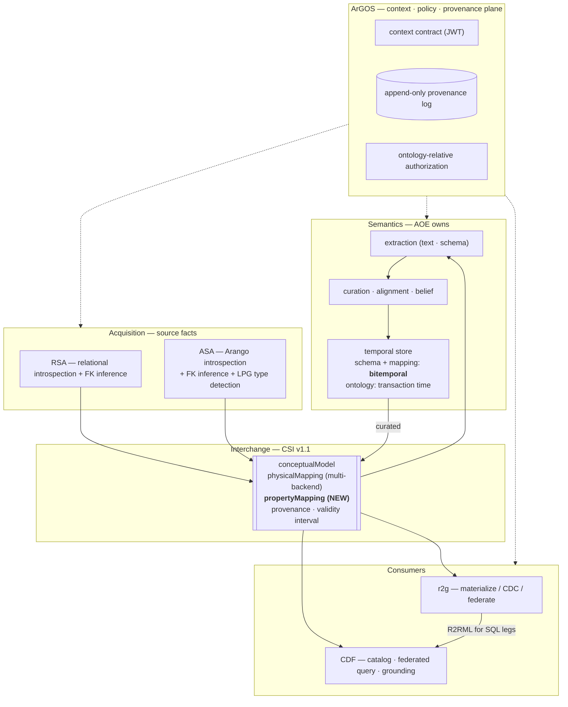

# One language for six components

> **Purpose.** Establish, from evidence in the repositories, why the portfolio does
> not currently interoperate; what the shared language must be; and what has to
> change in each component so that a human can curate an ontology in AOE and have
> that curation flow to CDF's federated query path — with provenance traceable end
> to end and both schemas and ontologies traversable in time.
>
> **This proposes; it does not decide.** No PRD has been modified. Section 10 lists
> the decisions this paper deliberately leaves open.
>
> **Update 2026-09-11.** Two open decisions answered by AK. **Q-5** (LPG type
> detection): ASA owns it. **Q-3** (schema temporality): bitemporal. Each answer, its
> consequences for §6, §7, §8, §8.1 and the sequence in §9, and the evidence rows in
> the appendix were added on that date; nothing else changed.
>
> **Update 2026-09-12.** **Q-1** (where the mapping lives) confirmed by AK: AOE. The
> answer adds a forward-looking topology note — a federation of AOE instances, one per
> source domain feeding a central hub — and the three design constraints it places on
> CSI v1.1 and the mapping-identity work *now*, so the option stays open without
> being built.
>
> **Update 2026-09-12 (estate moved).** Four repositories shipped against this paper:
> **RSA 0.8.0** (`bitemporal.py`), **ASA 0.13.0** (`provenance.compute_valid_time`, PRD
> §3.13.5), **r2g** (bitemporal pass-through in `csi.py`, unreleased on 0.4.0) and
> **arango-cypher-py** (analyzer band raised to `>=0.12.1,<0.13.0`). Steps **0** and **7**
> of §9 are done. The same day produced three new findings the paper now records: the
> two step-7 releases sit **outside every consumer's pin band** (ASA 0.13.0 vs `<0.13.0`
> in cypher-py and sparql-py; RSA 0.8.0 vs `<0.8.0` in r2g); r2g updated its **vendored**
> CSI schema in lockstep instead of de-vendoring (step 2 still open); and the CSI
> schema's `validTimeSource` enum admits two values where RSA's contract emits five, so
> r2g's validate-on-write **rejects a catalog-dated relational schema**. Versions,
> diagrams, §3.1, §5, §6.2, §7.2, §8.1, §9 and the appendix are updated accordingly.
>
> **Update 2026-09-15 (bands raised; one attribution corrected).** The 2026-09-12 form
> of step 0 is closed: `arango-cypher-py` and `arango-sparql-py` both admit ASA 0.13
> (`>=0.12.1,<0.14.0`, raised together on 2026-09-14 under the band invariant both PRDs
> now record) and `r2g` 0.4.1 admits RSA 0.8.0 (`>=0.8.0,<0.9.0`). It has re-opened a
> third time: **ASA 0.14.0** (the step-4 type-detection release) is on PyPI and outside
> both transpilers' bands. Separately, a re-check of the CDF tree by the cypher-py side
> found that **CDF never declared, installed or imported `arango-cypher-py`**; the
> 2026-09-06 downgrade was caused by `arango-sparql-py`'s *own* `<0.10` ceiling at the
> SHA CDF pinned, not by a cypher-py/sparql-py conflict inside CDF. §1, §3, §3.1, §5, §9
> and the appendix are corrected; the conclusion (step 0 was worth doing) stands, but
> §3.1 no longer claims a live CDF blocker.

---

## 0. Scope and method

Everything asserted about current behaviour was checked against the repositories or
measured against live databases on 2026-09-10. Claims are one of three kinds, and
the paper says which:

| Kind | Meaning |
|---|---|
| **Measured** | Observed by running code against a real database. |
| **Verified** | Read directly from source, schema, or dependency metadata; `file:line` given. |
| **Judgement** | An architectural recommendation. Argued, not observed. |

Capability gaps are stated as *"component X has no code for this"*, established from
module inventories and import sites — never as a claim about relative quality.

---

## 1. Executive summary

The portfolio has **six components, three mapping representations, two interchange
formats, three LPG type-field detectors, and no shared temporal model.** The pieces
were each built well; what is missing is the connective contract.

**One pin had already broken a build when this paper was written:** on 2026-09-06
`arango-sparql-py`'s own ASA ceiling (`<0.10`, at the SHA CDF pinned) silently downgraded
CDF's analyzer from 0.12.1 to 0.9.0 and broke `make seed` at the reverse-CSI export. At
the same time `arango-cypher-py` pinned `<0.10` while `arango-sparql-py` had moved to
`>=0.12.1` — unsatisfiable together in any environment that installs both, though CDF
itself never installs cypher-py (**corrected 2026-09-15**, §3.1). **Resolved 2026-09-11**
(cypher-py raised its band, commit `a196e74`, citing this paper's step 0); **re-opened
2026-09-12** when ASA 0.13.0 and RSA 0.8.0 shipped outside every consumer's band;
**closed 2026-09-14** (both transpilers `>=0.12.1,<0.14.0`, r2g 0.4.1 `>=0.8.0,<0.9.0`);
**re-opened 2026-09-15** by ASA 0.14.0. See §3.1.

Six concrete breaks stop the motivating scenario — *a human curates their relational
extraction in AOE, and CDF answers questions over the curated result*:

0. **Analyzer pin bands that lag the analyzers.** Observed, not predicted: one
   downgrade incident (2026-09-06) and two rounds of releases the consumers excluded.
   *(Verified — §3.1.)* **Resolved 2026-09-11; re-opened 2026-09-12; closed 2026-09-14;
   re-opened 2026-09-15 by ASA 0.14.0** (§3.1). Corrected 2026-09-15: the two
   transpilers were never co-installed inside CDF.
1. **Version drift.** r2g requires RSA `>=0.7.2,<0.8.0`; AOE pins `>=0.2` and has
   **0.2.0** installed. Five minor versions apart. *(Verified.)*
2. **Format gap.** The integration currency is CSI v1 + R2RML. AOE contains **zero
   references** to either. *(Verified.)*
3. **Mapping-fidelity loss.** AOE records provenance at class→table granularity only.
   The column→property correspondence exists solely as a URI naming convention, so the
   first curator rename destroys it irrecoverably. *(Verified.)*
4. **Granularity cliff in the interchange format.** CSI v1 carries entity and
   relationship mappings but **no property-level mapping**, and its physical side is
   Arango-only. Adopting CSI unchanged would not carry a column→property mapping.
   *(Verified.)*
5. **No schema temporality.** AOE time-travels *ontologies*. Nothing in the portfolio
   versions a *physical schema*, so a schema change cannot be traced to the ontology
   and mapping entities it should ripple through. *(Verified.)* The schema and mapping
   planes that close this break are **bitemporal** (Q-3, answered). **Recording side
   shipped 2026-09-12** (RSA 0.8.0, ASA 0.13.0, r2g pass-through); the *storage* side —
   the temporal store — is still absent.

The recommendation is **not** "AOE should import ASA and RSA." It is that
**the unit of exchange should be a versioned artifact, not a Python API** — because a
format carries a version contract and a shared import does not. Break 1 is precisely
what library coupling would have produced anyway.

---

## 2. The components today

### 2.1 Responsibilities, inputs, outputs, controls

| Component | Version | Responsibility | Input | Output | Control surface |
|---|---|---|---|---|---|
| **ASA** `arangodb-schema-analyzer` | 0.14.0 | ArangoDB introspection, **LPG type-discriminator detection** (owner per Q-5), relationship inference, statistics, tenancy, sharding, redaction, **bitemporal stamping** (valid time by fingerprint continuity, §3.13.5), CSI emission, OWL export | live ArangoDB | physical snapshot, conceptual schema, **CSI v1**, OWL/JSON-LD | `InferenceOptions`, redaction options, LLM providers |
| **RSA** `relational-schema-analyzer` | 0.8.0 | Relational introspection across 9 connectors, FK inference, conceptual model, **bitemporal stamping** (per-connector valid time under the fingerprint rule), OWL + **R2RML** export | Postgres, MySQL, SQL Server, Snowflake, DuckDB, Databricks, CSV | `PhysicalSchema`, `ConceptualSchema`, OWL, R2RML | `InferenceOptions`, samplers, providers |
| **r2g** | 0.4.1 | Relational→graph mapping; the reference RSA consumer; batch ETL, CDC, or federation; forwards RSA's bitemporal stamps into CSI | RSA `PhysicalSchema` | `MappingConfig`/`MappingBundle`, **CSI v1**, **R2RML**, materialized graph | mapping studio UI, naming conventions, shared keys |
| **AOE** `arango-ontoextract` | 1.9.0 | Ontology extraction from **text**; graph/relational schema extraction (with its own LPG type detection — to retire, Q-5); **curation**; **alignment**; **temporal versioning** | documents, live ArangoDB, relational sources | OWL/Turtle, SHACL, curated ontologies | curation UI, confidence thresholds, release gates |
| **CDF** | — | Federated query over sources without moving data; catalog; grounding; governance | CSI/R2RML artifacts, live sources | cited answers, `POST /federate` | M8 OBAC, M11 catalog manifest |
| **ArGOS** | v1 draft | Context, governance and provenance plane for the whole portfolio | tool events, identity | context contract (JWT), append-only provenance log | FR-5 ontology-relative authz, FR-6 event log |

### 2.2 Current data flow

Solid arrows are implemented paths. The dashed arrow is the one the motivating
scenario needs and which does not exist.

Three things this makes visible:

- **AOE is an island.** It emits OWL and SHACL into files. Nothing downstream consumes
  them, and nothing upstream reaches it in a format it shares with the others.
- **ASA has two library consumers — neither of them AOE.** `arango-cypher-py` and
  `arango-sparql-py` both depend on it. CDF reaches it through `arango-sparql-py` and,
  for the reverse-CSI export, imports it directly; `arango-cypher-py` is **not** in the
  CDF tree (corrected 2026-09-15, §3.1).
  AOE is the only component that reimplements ASA's job instead of calling it.
  *(Verified; see §3.1 for the version conflict this has already caused.)*
- **AOE duplicates both analyzers' front ends** with its own direct paths, using RSA
  only for `create_connector`. That duplication includes LPG type detection, of which
  the portfolio now has **three** implementations (§2.3).

### 2.3 What AOE reimplements

*Measured 2026-09-10, `scripts/benchmarks/relationship_recovery.py`, identical data in
every fixture:*

| Source shape | AOE classes | AOE relationships | Library inferred |
|---|---:|---:|---:|
| Relational — PK + FK declared | 4 | **3** | 0 *(already declared)* |
| Relational — PK only, no FK | 4 | **0** | **3** @ 0.85 |
| Relational — neither | 4 | 0 | 0 |
| ArangoDB — edge collections | 4 | **3** | 0 *(already explicit)* |
| ArangoDB — join-style fields | 4 | **0** | **3** @ 0.90 |

Where relationships are **declared**, AOE gets them all and the libraries correctly add
nothing. Where they are only **implied**, AOE emits an ontology of disconnected classes
and the libraries recover every relationship. A join-modelled Arango database or a
constraint-free warehouse currently yields **zero object properties** from AOE.

**LPG type detection exists three times.** *(Verified 2026-09-11.)* ASA's
`type_detection.py` picks the discriminator from snapshot statistics (candidate names,
distinct-value bounds `[MIN, 32]` by default, coverage fraction, value-shape regex,
single-value edge fallback), is exercised by a real-ArangoDB regression test, and is
exposed through `analysisOptions.entityStrategy` in the v1 tool contract; its result is
what CSI's `style: LABEL` / `GENERIC_WITH_TYPE` entries carry. AOE's `_lpg_*` functions in
`schema_extraction.py` (~400 lines) sample the live database with a two-tier rule —
tier-1 names (`type`, `_type`, `entityType`, `@type`, `entity_type`) accepted on coverage
alone so a rich graph is not collapsed by a distinct-count cap, tier-2 names gated by
cardinality and a class-like value test — and additionally detect edge label fields and
endpoint type fields (`_fromType` / `_toType`). `arango-cypher-py`'s `schema_acquire.py`
has a third, presence-based detector (a field on 80 % of 20 sampled docs) used only to
classify a database as LPG or PG. Three detectors can give three answers to "what is
the type field" for one database. **Q-5 resolves ownership: ASA.**

Roughly 2,400 lines in AOE stand in for ~22,000 lines of library. AOE has no equivalent
at all for taxonomy discovery, multi-tenancy scoping, sharding profiles, redaction,
statistics, GraphRAG, the evaluation harness, the interchange formats, or the LLM
provider abstraction.

---

## 3. Library dependency graph

### 3.1 Analyzer pin bands that lag the analyzers — one incident, three re-openings

> **Correction (2026-09-15).** The original text below says CDF "depends on both"
> transpilers and that the cypher-py/sparql-py conflict "blocks CDF today". Re-checked
> against the CDF tree by the cypher-py side and confirmed here: `arango-cypher-py` is
> not declared in CDF's `pyproject.toml`, not installed in its venv, never imported
> (the one mention is a docstring in `src/cdf/query/nl.py`), and never was (`git log -S`
> is empty). CDF installs `arango-sparql-py` by git SHA (`deploy/pins/arango-sparql-py.txt`)
> and imports ASA directly in `deploy/arango/export_csi.py`. The 2026-09-06 incident
> (CDF commit `b3f42f5`, "analyzer-ceiling pin fix") was sparql-py's **own** `<0.10`
> ceiling at the pinned SHA `e4f64f5` downgrading the venv's analyzer from 0.12.1 to
> 0.9.0 — one component's pin breaking a library another component imports directly.
> The cypher-py/sparql-py conflict was real as declared metadata and would have fired in
> any environment installing both (sibling dev venvs do), but it was never a live CDF
> blocker. The thesis this section draws — independently pinned Python bands fail
> silently where a format contract cannot — is unchanged; the priority claim is
> withdrawn.

As written on 2026-09-10, the two ASA-consuming transpilers pinned **mutually exclusive**
ASA ranges:

| Consumer | ASA range (2026-09-10) | 2026-09-12 | 2026-09-14 | vs ASA 0.14.0 (2026-09-15) |
|---|---|---|---|---|
| `arango-cypher-py` 0.2.0 | `>=0.9.0,<0.10.0` | `>=0.12.1,<0.13.0` (`a196e74`, 2026-09-11) | `>=0.12.1,<0.14.0` (`617178a`) | ⛔ excluded |
| `arango-sparql-py` 0.1.0 | `>=0.12.1,<0.13.0` | unchanged | `>=0.12.1,<0.14.0` (`df4f397`) | ⛔ excluded |
| `r2g` (RSA band) | `>=0.7.2,<0.8.0` | unchanged | `>=0.8.0,<0.9.0` (0.4.1) | ✔ admits RSA 0.8.0 |

**Resolved 2026-09-11:** cypher-py raised its band, citing this paper's step 0, and both
now co-install on ASA 0.12.x. **Superseded 2026-09-12:** ASA released **0.13.0** — the
bitemporal release this paper commissioned — and both consumers exclude it. RSA did the
same: **0.8.0** shipped while r2g still requires `>=0.7.2,<0.8.0`. **Closed 2026-09-14:**
both transpilers raised together to `>=0.12.1,<0.14.0` and r2g 0.4.1 admits RSA 0.8.0,
so the step-7 stamps are installable everywhere. **Re-opened 2026-09-15:** ASA **0.14.0**
(step 4, type-detection convergence) is the latest on PyPI and outside both transpilers'
bands; by the band invariant the next raise lands in both repositories together. The
pattern is now the finding: every analyzer minor re-opens step 0 until bands track the
*contract* rather than the minor. The original text follows for the record.

There is no ASA version satisfying both. ~~CDF references both across
`src/cdf/adapters/`, `src/cdf/catalog/capabilities.py` and `src/cdf/eval/`~~ *(withdrawn
2026-09-15 — none of those paths import either transpiler; see the correction above)*,
so this is not hypothetical — and it has already fired. From
`arango-sparql-py/pyproject.toml:40`:

> *"0.12 carries the extended tool contract (entityStrategy, detectForeignKeys) that
> consumers like the CDF reverse-CSI export require — a `<0.10` ceiling silently
> DOWNGRADES a co-installed 0.12 and breaks them (observed: CDF `make seed`,
> 2026-09-06)."*

**This is the paper's thesis demonstrated four days before the paper was written.** Two
components sharing a Python API, pinned independently, produced a silent downgrade that
broke a third component's build. A format contract could not fail this way: CSI v1
artifacts written by ASA 0.9 and 0.12 are both still CSI v1.

*(Judgement, as written 2026-09-10.)* ~~This conflict is **more urgent than anything else
in this paper**, because it blocks CDF today~~ *(withdrawn 2026-09-15: it did not block
CDF; the incident CDF suffered was sparql-py's own ceiling, fixed in `b3f42f5` on
2026-09-06)* — it is still independent of every architectural decision here and was
still worth resolving first, which it was.

Two further structural observations:

- **CDF consumes artifacts where it can, libraries where it must.** Its catalog builder
  reads CSI and R2RML files — the loosely-coupled pattern. Its query path imports
  `arango-sparql-py` (git-SHA pinned) and its reverse-CSI export imports ASA directly,
  which is where a lagging band enters. It does **not** import `arango-cypher-py`
  (corrected 2026-09-15). *(Verified: `src/cdf/catalog/builder.py`; `pyproject.toml`;
  `deploy/pins/`; `deploy/arango/export_csi.py`.)*
- **r2g vendors a copy of the CSI schema** (`schemas/csi_v1.schema.json`, described in
  `src/r2g/csi.py:14` as "a vendored copy of the analyzer's authoritative" schema).
  That is a silent drift vector: ASA can revise CSI without r2g noticing. *Exercised
  2026-09-12:* both copies were hand-edited in lockstep for the bitemporal keys and are
  semantically identical today — but the enum they share (`validTimeSource: observed |
  fingerprint-continuity`) is narrower than RSA's tool contract (`catalog | event | file |
  fingerprint-continuity | observed`), and r2g's CLI validates on write (`main.py:600`).
  A Snowflake-dated RSA schema therefore fails `r2g export-csi`. Step 2 stays open.

---

## 4. The interchange layer

### 4.1 Three mapping representations, three granularities

| Artifact | Owner | Granularity | Carries transformations? | Physical side |
|---|---|---|---|---|
| **`MappingConfig` / `CollectionMapping`** | r2g | **column → property**, with fan-in and computed expressions (`FieldExpression`: `sources[]`, `expression`, `engine`) | **Yes** | ArangoDB |
| **R2RML** | RSA / r2g → Ontop | column → property, per W3C | Yes, via templates | SQL only |
| **CSI v1** | ASA (authoritative), r2g (vendored copy — both revised 2026-09-12 in lockstep for the bitemporal provenance keys) | **entity + relationship only** | **No** | **ArangoDB only** |

**The granularity cliff is CSI.** It is the artifact CDF's M11 catalog treats as the
mapping hub, yet it is the only one of the three that cannot express a property-level
mapping.

*Verified from `csi.schema.json`:* the envelope is
`{csiVersion, conceptualModel, arangoPhysicalMapping, provenance}`, all required.
`conceptualModel` has `entities`, `relationships`, `properties`.
`arangoPhysicalMapping` has **only** `entities` and `relationships`. Property mappings
are absent from the v1 contract. (`additionalProperties: true` permits an extension,
but nothing standardises one.)

**Correction (2026-09-14, code-read of the artifacts):** the *contract* omits it, but
the *documents* carry it. Every CSI in CDF's `deploy/csi/` — r2g-produced and
ASA-produced alike — has `arangoPhysicalMapping.entities.<E>.properties.
.field`,
the property→physical-field correspondence, as an unstandardised additive extension
both producers happen to agree on. So the granularity cliff is in the schema text, not
in the data: standardising the extension (§8.1 `propertyMapping`) is a documentation
and validation change, not a new emission. AOE's CSI importer (2026-09-14) already
reads it as `aoe:sourceField`.

### 4.2 Is the ontology↔schema mapping represented as graph-to-graph?

**Partly — and this is the sharpest finding in the paper.**

CSI v1 *is* a graph-to-graph correspondence in shape. The conceptual model is a graph
(entities; relationships with `fromEntity`/`toEntity`; properties). The physical mapping
maps each conceptual node and edge onto a physical realization:

Entities map with `style: COLLECTION | LABEL`; relationships with
`style: DEDICATED_COLLECTION | GENERIC_WITH_TYPE`. The `LABEL` / `GENERIC_WITH_TYPE`
styles model the LPG case — types held in a discriminator field — natively.

So it is a **node↦node and edge↦edge homomorphism between two graphs**. That is the
right idea. Three limitations keep it from being the graph-to-graph mapping the
portfolio needs:

1. **It stops at edges.** No property↦column arm, so the finest and most
   curation-sensitive correspondence is outside the contract.
2. **The physical side is Arango-shaped.** The key is literally `arangoPhysicalMapping`.
   A relational physical graph has no home in CSI; it goes out-of-band as R2RML. The
   "one language" is therefore not one language — it is one language for graphs and a
   different one for tables.
3. **Correspondences are not first-class.** The mapping is a dictionary keyed by
   conceptual name. A correspondence has no identity, no version, no author, no
   confidence and no history. You cannot cite it, review it, supersede it, or ask when
   it changed — which is exactly what curation, provenance and time travel all require.

**Judgement.** Treating a mapping edge as a first-class, addressable, versioned entity
— rather than a dictionary entry — is the single modelling change that makes provenance,
HITL curation and temporal ripple-tracing all fall out of the same mechanism.

---

## 5. The six breaks, with evidence

| # | Break | Evidence | Consequence |
|---|---|---|---|
| 0 | **Analyzer bands lag the analyzers** | sparql-py's own `<0.10` ceiling downgraded CDF's analyzer (`b3f42f5`); cypher-py `<0.10` vs sparql-py `>=0.12.1` unsatisfiable in any shared venv (CDF was not one — corrected 2026-09-15) | Broke CDF `make seed` 2026-09-06. Resolved 2026-09-11; re-opened 2026-09-12 (ASA 0.13.0, RSA 0.8.0 excluded); closed 2026-09-14 (both transpilers `<0.14.0`, r2g 0.4.1); **re-opened 2026-09-15 by ASA 0.14.0** (§3.1) |
| 1 | Version drift | r2g `>=0.7.2,<0.8.0`; AOE `>=0.2`, installed 0.2.0 | Objects cannot be exchanged even if both used RSA |
| 2 | Format gap | 0 CSI/R2RML references in `arango-ontoextract/backend/app` | AOE can neither read r2g's output nor write CDF's input |
| 3 | Mapping fidelity | provenance is `source_db`/`source_collection`/`source_host` only; property URIs are `ns[f"{table}.{column}"]` (`relational_schema_extraction.py:159`) | First curator rename severs the column link, unrecoverably |
| 4 | Granularity cliff | `arangoPhysicalMapping` has no property arm **in the contract**; both producers emit one anyway (`entities.<E>.properties.
.field`, unstandardised) | Adopting CSI unchanged loses column→property only for consumers that validate strictly; standardise the extension rather than invent one (§4.1 correction) |
| 5 | No schema temporality | only `physical_schema_fingerprint`, a hash, on the unused ASA path | Schema change cannot be traced to affected ontology entities. **Recording side shipped 2026-09-12** (RSA 0.8.0, ASA 0.13.0, r2g pass-through); storage side still absent |

Break 3 deserves emphasis because it is invisible until someone tries HITL. AOE can
*display* an imported ontology today. It cannot *hand back a curated mapping*, because
it never recorded which column produced which property as data — only as a string
inside a URI, which curation is in the business of rewriting.

---

## 6. Provenance, end to end

### 6.1 What must be traceable

The target is a single chain from a stored value to a cited answer, and back:

### 6.2 What exists, and where the chain breaks

| Link | Status | Evidence |
|---|---|---|
| value → physical schema | **partial** — introspected per run and, since 2026-09-12, **stamped with valid and transaction time** (RSA 0.8.0, ASA 0.13.0); still never *stored* as a version | no schema history collection |
| physical schema → mapping | **exists in r2g**, at full granularity | `CollectionMapping.field_expressions` |
| mapping → ontology | **broken in AOE** | class→table only; no property arm |
| ontology → curation decision | **exists** | AOE `curation_decisions`, temporal versioning |
| curation → mapping | **absent** | AOE has no mapping to amend |
| query leg → answer citation | **exists** | CDF M7 grounding, answer envelope |
| cross-tool attribution | **specified, not built** | ArGOS FR-6 append-only event log |

ArGOS FR-6.5 already requires *"history of entity X"*, *"actions by principal Y"*, and
*"changes in project Z between T1 and T2"*, and FR-10.4 requires one provenance view
spanning AOE and r2g. **The specification is correct and ahead of the implementations.**
What blocks it is that AOE and r2g do not agree on what an entity *is*: they hold
different ontologies, with different URIs, over the same database.

**Judgement.** Provenance cannot be retrofitted as a logging concern. It requires a
shared entity identity across tools — which is the same requirement as §4.2's
first-class mapping edge.

---

## 7. Temporality

### 7.1 What AOE has

AOE versions ontology entities on a `[created, expired)` interval with
`NEVER_EXPIRES = sys.maxsize` as the open-ended sentinel, chosen so range scans on an
MDI index need no special case. `get_at_timestamp()` reconstructs a full ontology as of
any instant. *(Verified: `app/db/temporal_constants.py`; `app/services/temporal.py`,
909 lines.)*

This is a solid **uni-temporal** model: one interval, transaction-time semantics.

### 7.2 What is missing

Nothing **stores** a versioned **physical schema**. Since 2026-09-12 the analyzers
*stamp* one — RSA 0.8.0 and ASA 0.13.0 emit `transactionTime`, `validTime.from`,
`validTimeSource` and `predecessorFingerprint`, and r2g forwards them — but AOE reads
none of it: it computes a `physical_schema_fingerprint` only on the ASA path, which is
not installed, and keeps no schema history. So today:

- a column rename is invisible until an extraction is re-run;
- there is no way to ask *"what did this schema look like in June?"*;
- and there is no edge from a schema change to the ontology entities that depend on it,
  so **ripples cannot be traced** — the requirement that motivated this section.

### 7.3 Proposed model

Three versioned planes sharing one clock and one interval convention, joined by
first-class mapping edges that are themselves versioned. The schema and mapping planes
carry **two** intervals — valid time and transaction time (Q-3, answered); the ontology
plane keeps its existing single transaction-time interval until migrated (see the Q-3
answer for the sub-decision):

Consequences, all of which follow from the one change:

- **Ripple tracing** becomes a graph traversal: from a schema version, follow mapping
  edges valid in the same interval to the ontology entities they reach.
- **Schema time travel** works the same way ontology time travel already does — one
  convention, one query shape, one cache-invalidation story.
- **Impact analysis before the fact**: given a *proposed* schema change, traverse to
  find what would break.
- **Curation is attributable at mapping granularity**, because the mapping edge is an
  entity a decision can point at.

**Judgement on bitemporality.** AOE's single interval conflates *when the system learned
something* with *when it was true of the source*. A schema that changed on Monday but was
re-introspected on Friday is indistinguishable from one that changed on Friday. If
schema ripples are to be trusted for audit, the schema plane needs **valid time as well
as transaction time**. This is a real cost — two intervals, more complex queries. **It was
listed as an open decision (§10, Q-3) and has been answered: bitemporal.** The answer
block under Q-3 records the sub-decisions (which planes, where valid time comes from per
source, index shape, default query semantics).

---

## 8. Target architecture

The load-bearing claims:

1. **CSI is the only thing that crosses component boundaries.** No component imports
   another's Python API across the semantic boundary. Acquisition libraries may be
   imported *by whoever acquires*, but their output leaves as CSI.
2. **CSI becomes round-trippable.** Today it flows one way, analyzer→consumer. AOE must
   both read and write it, or curation cannot return. The same read-curate-publish
   contract, applied per hop, is what would let AOE instances federate later — one
   spoke per source domain, a central hub aligning their publications (Q-1).
3. **AOE owns the temporal store for all three planes** — schema, mapping, ontology —
   because it already owns the only working temporal implementation. The two new planes
   are **bitemporal from birth** (Q-3): every version carries a valid-time interval
   (when it was true of the source) and a transaction-time interval (when the store
   knew it). The ontology plane keeps AOE's single `[created, expired)` interval, which
   *is* transaction time, so cross-plane traversals join on transaction time today and
   gain valid time on the ontology side only if that plane is migrated later.
4. **ArGOS supplies identity, policy and the event log** to every component, so
   "who changed this mapping, under what authority" has one answer.
5. **Facts about a database are detected once, in the acquisition library.** Which
   field holds the entity type is such a fact (Q-5, answered): ASA detects it, it
   travels as CSI `style: LABEL` / `GENERIC_WITH_TYPE` entries with `typeField` and
   `typeValue`, and no semantic component or transpiler re-detects it. A curator may
   *override* it in AOE, and the override travels back the same way (§8.1).

### 8.1 Required CSI v1.1 extensions

| Extension | Why | Breaks v1? |
|---|---|---|
| `propertyMapping` — property ↦ source column/field, with expression + fan-in. **Standardise what both producers already emit** (`entities.<E>.properties.
.field`, §4.1 correction); expression and fan-in are the genuinely new part | close the granularity cliff (§4.1) | additive |
| `physicalMapping` generalized beyond `arangoPhysicalMapping` (relational, ClickHouse…) | one language for tables and graphs (§4.2) | additive alias; keep old key |
| stable correspondence **identity** on every mapping entry — a URI minted by the publishing instance, unique across instances | first-class mapping edges (§4.2); survives the spoke→hub hop in a federated topology (Q-1) | additive |
| **two intervals on the envelope and on every mapping entry**: `validTime` (true of the source) and `transactionTime` (known to the store), plus `validTimeSource: catalog \| event \| observed` stating where valid time came from | bitemporal schema/mapping planes (§7.3, Q-3). Sources differ: Snowflake exposes `LAST_ALTERED` in `INFORMATION_SCHEMA.TABLES`; PostgreSQL has no DDL timestamp without event triggers; ArangoDB records none — so valid time often *defaults to observation time* and the audit must be able to see that it did. **Shipped 2026-09-12** on the envelope (RSA 0.8.0, ASA 0.13.0, r2g pass-through; CSI schema revised) **with one defect:** the CSI enum for `validTimeSource` lists only `observed` and `fingerprint-continuity`; RSA emits `catalog`, `event` and `file` too, and its own contract lists all five. Per-table `validFrom` is not yet in CSI (no relational physical-mapping extension exists) | additive |
| schema **fingerprint + predecessor** reference | ripple tracing (§7.3) | additive |
| **publication scope** — what the publisher withheld (tables, columns, concepts) and under whose authority, plus the publisher's identity and the pinned versions of any ingested publications | a spoke's filter is declared, never implied, so hub alignment does not read an omission as a missing concept; version pinning across hops (Q-1) | additive |
| **detection provenance on `LABEL` / `GENERIC_WITH_TYPE` entries** — candidate fields considered, coverage, distinct count, and an `overriddenBy` curation reference when a human changed the detected `typeField` | Q-5: ASA detects, AOE may override, the override must round-trip (§9 step 4) | additive |

All seven are additive, so v1 consumers keep working — important, because CDF's M11
catalog already reads v1 in production paths.

---

## 9. Recommended sequence

Ordered so each step is independently useful and the risky work comes last.

| # | Step | Unlocks | Effort |
|---|---|---|---|
| **0** | **Resolve the ASA pin conflict.** ~~Raise `arango-cypher-py` to the 0.12 band so it and `arango-sparql-py` can co-install.~~ **Done 2026-09-11** (`a196e74`). ~~**Re-opened 2026-09-12 in a new form:** raise `arango-cypher-py` and `arango-sparql-py` to admit ASA **0.13.0** and `r2g` to admit RSA **0.8.0**, or none of the step-7 stamps reach CDF.~~ **Done 2026-09-14** (cypher-py `617178a`, sparql-py `df4f397`, r2g 0.4.1). **Re-opened 2026-09-15:** ASA **0.14.0** (step 4) is outside both transpilers' `<0.14.0` bands; raise both together to `<0.15.0`. Bands should track the analyzers' *contract* version, not their minor version — both transpilers now document an "analyzer-band invariant" for exactly this reason, and this third re-opening is the argument for it. | unbreaks CDF `make seed` (done); lets the bitemporal releases be installed (done); lets the converged type detector reach cypher-py and sparql-py (open) | small |
| 1 | **Align RSA versions.** Move AOE to the r2g range (now `>=0.8.0,<0.9.0`); re-run the relationship benchmark to confirm no regression. **Done 2026-09-14** (`arango-ontoextract` `deps/rsa-0.8-band`; backend unit suite 2960 green on RSA 0.8.0; benchmark re-run still to do). | removes break 1; makes any later sharing possible | small |
| 2 | **De-vendor the CSI schema.** r2g consumes ASA's schema rather than a copy. **Still open, and now demonstrated:** on 2026-09-12 both copies were hand-edited in lockstep for the bitemporal keys (§4.1). While here, widen the shared `validTimeSource` enum to RSA's five values so `r2g export-csi` stops rejecting catalog-dated schemas, and add r2g tests for `catalog` / `event` / `file` (only `fingerprint-continuity` is exercised). | removes a silent drift vector; unblocks relational valid time in CSI | small |
| 3 | **AOE reads CSI v1.** Import an r2g/ASA/RSA artifact as an ontology. **Done 2026-09-14** (`arango-ontoextract` `feat/csi-import`: service + API + MCP tool; records collection, mapping style, the analyzer's `LABEL` discriminator, property→field as `aoe:sourceField`, join keys, and the bitemporal stamps; does not re-detect types). | AOE can *see* what the fabric sees | medium |
| **4** | **Converge LPG type detection on ASA** *(Q-5, AK 2026-09-11)*. **ASA side done 2026-09-14** (0.14.0, `feat/type-detection-convergence`: tier-1 acceptance, added candidates, `_fromType`/`_toType` endpoint resolution, 15 tests); AOE's CSI importer records the analyzer's answer instead of re-detecting; retiring AOE's and cypher-py's own detectors is the remaining half. Port into ASA's `type_detection.py` what AOE's detector has and ASA's lacks — tier-1 acceptance on coverage alone (so a distinct-count cap never collapses a rich graph), the extra candidates (`@type`, `entity_type`, `category`, `predicate`), edge-label candidates, and `_fromType` / `_toType` endpoint detection — and add AOE's fixtures to ASA's real-ArangoDB regression test. Then AOE and `arango-cypher-py` consume the `LABEL` / `GENERIC_WITH_TYPE` entries from CSI instead of detecting, and their detectors (~400 lines in AOE; `schema_acquire.py` in cypher-py) are retired. Depends on step 0 (both consumers must be on the same ASA band) and, for AOE's side, on step 3. | one answer to "what is the type field" across ASA, AOE, cypher-py, sparql-py and CDF; removes the third reimplementation in §2.3 | medium |
| 5 | **AOE persists mapping as data** — property↦column as first-class, versioned edges, surviving curation edits; **bitemporal from birth** (Q-3): valid and transaction intervals on every edge version, MDI index over both; edge identity is a **publisher-minted URI**, not a store key (Q-1). | **the HITL prerequisite**; breaks 3 and 4 | medium–large |
| 6 | **AOE writes CSI v1.1.** Curated ontology + mapping back out — including any curator override of a detected `typeField` and a **declared publication scope** (what was withheld, by whom, and the pinned versions of anything ingested) (§8.1, Q-1). | closes the round trip; the publish side of the contract a federated topology would reuse | medium |
| **7** | **Analyzers emit both times** *(Q-3, AK 2026-09-11)*. ASA and RSA stamp every snapshot with transaction time (observation) and the best available valid time per source kind — Snowflake `INFORMATION_SCHEMA.TABLES.LAST_ALTERED`; PostgreSQL DDL event triggers where the operator installs them, else observation; ArangoDB observation only — and write both plus `validTimeSource` into CSI v1.1 (§8.1). Independent of AOE; useful to CDF's M11 catalog on its own (as-of on citations, CC-4). **Requirement text lands in the analyzers' own documents, as recording-not-storage:** `arango-schema-analyzer/docs/PRD.md` §3.13.5 (ArangoDB has no DDL timestamps, so ASA's contribution is a fingerprint-continuity lower bound on `validFrom`) and `relational-schema-analyzer/docs/DESIGN-ADDENDUM-bitemporal.md` (per-connector catalog signals, with the rule that a catalog date is trusted only when the fingerprint changed, because Snowflake's `LAST_ALTERED` moves on DML). Both drafted 2026-09-11 as PRs on the org repos. r2g passes the stamps through. **Done 2026-09-12:** RSA 0.8.0 (`bitemporal.py`; prior run on the tool contract, MCP and CLI), ASA 0.13.0 (`provenance.compute_valid_time`; `input.previousAnalysis` routes `analyze` through `analyze_incremental`; `analyze --prior-run`), r2g `e5a2ff9` (four keys threaded onto `provenance`). **Follow-ups belong to steps 0 and 2:** consumer bands, the CSI enum, r2g's test coverage. | valid time exists at the source of truth, not reconstructed later | medium |
| 8 | **Bitemporal schema plane in the temporal store**, with predecessor links; MDI index over `[validFrom, validTo, createdAt, expiredAt]` following FR-5.3's pattern; as-of queries take a `(valid_at, known_at)` pair with `known_at = now` as the default so existing UI behaviour is unchanged. | schema time travel; ripple tracing that survives audit | large |
| 9 | **AOE consumes ASA/RSA inference** for implied relationships. | the measured 0→3 recovery in §2.3 | medium |
| 10 | **ArGOS SDK adoption** in AOE and r2g (FR-8, FR-10). | one provenance view across tools | medium |

Steps 1–4 are prerequisites and low-risk; step 4 is the first place the boundary rule
is applied to code that already exists on both sides, which makes it a useful rehearsal
for step 9. Step 7 landed *before* steps 0–2 were finished, and the result is
instructive: the stamps exist in three repositories and reach none of their consumers
until the bands and the shared enum catch up. Do steps 0 and 2 next. **Step 5 is the pivot**: without it, steps 6–10 have nothing to carry. Step 7
sits before step 8 because valid time must be *captured* at introspection; it cannot be
recovered afterwards. Step 9 is deliberately late — it is the most visible improvement
but the least structural, and it is worthless if the result cannot round-trip.

---

## 10. Open decisions — for review

**Q-1. Where does the mapping live?** This paper assumes AOE, because AOE owns the only
temporal store and the curation UI. The alternative is CDF's M11 catalog, which already
claims mappings as a responsibility. Splitting them is the worst outcome. *Recommend:
AOE owns the editable mapping; M11 ingests published versions.*

> **Answered — AK, 2026-09-12: AOE owns the editable mapping; M11 ingests published
> versions.** With a forward-looking note that shapes two of the steps in §9.
>
> **The expected future topology.** Source-system owners will want to control their
> own ontology mapping and curation — in particular, to filter which tables and columns
> may enter the federation *before* sharing. When that happens the natural shape is a
> **federation of AOE instances**: one spoke AOE per source domain doing local
> extraction, curation and filtering, publishing a curated CSI; a central hub AOE
> ingesting the spokes' publications, running alignment (M3) into the master ontology,
> and publishing that; CDF's M11 ingesting the master. This is the data-mesh shape —
> domain-owned products, federated governance — with the CSI artifact as the product.
>
> **Why it costs nothing to keep open.** It is not a new mechanism. Every hop is the
> same contract this answer already commits to — *ingest a published CSI version,
> curate, publish a new version* — applied one more time. The paper's thesis that the
> unit of exchange is a versioned artifact rather than a Python API is precisely what
> lets AOE instances federate without importing each other's code.
>
> **The strongest argument for it is credentials, not curation.** In hub-and-spoke the
> hub never touches a source system. Only the spoke holds the source's service
> credential (M1) and only the spoke's steward identity introspects (product PRD §4.1,
> ADR-0004). The hub sees a document the owner chose to publish. "Who else can see our
> database?" has the answer *nobody*, which is a shorter conversation than any
> access-control matrix.
>
> **Three constraints to honour now, so the topology is possible later:**
>
> 1. **Publication scope is declared, never implied.** When a spoke filters what it
>    shares, the published CSI states what was withheld and by whom — the same
>    "declared, not silently missing" standard CDF applies to withheld sources in an
>    answer envelope. Otherwise hub alignment will read an intentional omission as a
>    missing concept. Additive CSI v1.1 field (§8.1). It is a provenance fact, not an
>    access-control rule: the filter reduces exposure; CDF still enforces entitlement
>    at query time (M8, M16).
> 2. **Correspondence identity is global.** §4.2's first-class mapping edges must carry
>    identifiers that survive the hop and are unique across spokes: URIs minted by the
>    publishing spoke, not store-local keys (§8.1, step 5).
> 3. **A third clock.** Q-3 gives each version valid time and transaction time. In a
>    federation the spoke's transaction time and the hub's receipt time differ, and an
>    audit asks for both; hub ingestion is its own transaction-time event that carries
>    the spoke's stamps forward unchanged. Another reason the two-interval decision
>    was right.
>
> **Two risks to name early.** *Version skew:* the hub aligns spoke publications curated
> at different times, so the master ontology's provenance must **pin** which published
> version of each spoke it aligned — the CC-9 pin discipline applied to ontologies.
> *Alignment load:* AOE's alignment service was built for one instance's ontologies; a
> hub aligning N spokes meets conflicts the current corpus never produces, which is the
> test bed the Federation Forge (M15) exists to generate.
>
> **Decision on timing:** not built now. Recorded here so steps 5 and 6 (§9) and the
> §8.1 extensions are shaped to allow it. The worst outcome this paper names — a
> mapping living in two places — would otherwise arrive as soon as a second owner
> wanted a say.

**Q-2. Does CSI grow, or does a second format appear?** §8.1 proposes growing CSI. The
alternative — a distinct mapping-interchange artifact — keeps CSI simple, at the cost of
one more thing to version. *Recommend: grow CSI additively.* Q-5's answer adds one more
additive field (§8.1, detection provenance) and does not change this recommendation.

**Q-3. Bitemporal or uni-temporal for schemas?** §7.3 argues valid-time matters for
audit. It roughly doubles query complexity on the schema plane. *No recommendation —
this is a product decision about what "trace the ripples" must withstand.*

> **Answered — AK, 2026-09-11: bitemporal.** Ripple tracing must withstand audit, so a
> schema version records both when it was true of the source and when the store learned
> it.
>
> **Sub-decisions this implies, recorded here so they are not rediscovered:**
>
> 1. **Which planes.** Schema and mapping planes are bitemporal from birth (they are
>    new; §9 steps 5, 7, 8). The ontology plane keeps AOE's existing single
>    `[created, expired)` interval, which is transaction time, so cross-plane traversals
>    join on transaction time. Migrating the ontology plane to valid time is a separate
>    decision for AOE's PRD (§5.3, FR-5.3) and is *not* assumed here.
> 2. **Where valid time comes from.** It must be captured at introspection (step 7), per
>    source kind: Snowflake `LAST_ALTERED`; PostgreSQL only via DDL event triggers the
>    operator installs; ArangoDB not at all. When the source cannot say, valid time
>    defaults to observation time and the record says so (`validTimeSource: observed`),
>    so an auditor can tell a known change date from an assumed one.
> 3. **Index shape.** One MDI index over the four bounds, following FR-5.3's existing
>    `[created, expired]` pattern; open-ended bounds keep the `NEVER_EXPIRES` sentinel.
> 4. **Query semantics.** As-of takes a `(valid_at, known_at)` pair; `known_at = now`
>    is the default, which reproduces today's uni-temporal behaviour, so the VCR
>    timeline and existing callers do not change until they opt in.
> 5. **Cost accepted.** Two intervals on two planes, more complex range predicates, and
>    a per-source valid-time capture task. §11's "no performance work" caveat applies.
>
> **Consequences recorded in this paper:** break 5 (§1), the physical-schema node in the
> provenance chain (§6.1), the §7.3 model text and diagram, target-architecture claim 3
> and the temporal-store node (§8), the two-interval envelope extension with
> `validTimeSource` (§8.1), and steps 5, 7 and 8 of the sequence (§9) with the
> renumbering that follows. Outside this paper: the **recording** requirement for the
> analyzers was drafted 2026-09-11 (ASA PRD §3.13.5, RSA `DESIGN-ADDENDUM-bitemporal.md`)
> and **implemented 2026-09-12** (RSA 0.8.0, ASA 0.13.0, r2g pass-through), with the
> consumer-band and CSI-enum follow-ups recorded in §9 steps 0 and 2. AOE PRD §5.3 /
> FR-5.3 (the **storage** side) still needs its amendment when the sequence reaches step 8.

**Q-4. Does AOE import the analyzers, or only their artifacts?** The paper's thesis is
artifacts. But relationship inference (step 9) may be impractical over a file — it may
need the live sampler. *Recommend: artifacts across semantic boundaries; direct import
permitted only inside an acquisition adapter.* Q-5's answer is consistent: type
detection needs live sampling, so it lives in the acquisition library, and its result
crosses the boundary as a CSI artifact.

**Q-5. Who owns LPG type detection?** Working out which field holds the entity type is a
fact about a database, so by the boundary rule it belongs in ASA — but AOE has the only
working implementation, and it is substantial. *No recommendation.*

> **Answered — AK, 2026-09-11: ASA owns LPG type detection.**
>
> Two corrections to the premise, found while recording the answer. First, AOE does not
> have the only implementation: ASA already detects the discriminator
> (`schema_analyzer/type_detection.py::_pick_best_type_field`, from snapshot statistics,
> with a real-ArangoDB regression test and `analysisOptions.entityStrategy` in its tool
> contract), and `arango-cypher-py` carries a third, presence-based detector in
> `schema_acquire.py`. Second, the substantial part of AOE's implementation is not the
> detection but the heuristics ASA lacks: tier-1 acceptance on coverage alone, four
> extra candidate names, edge-label detection, and endpoint type fields
> (`_fromType` / `_toType`). So the task is convergence, not a port into empty space.
>
> **Consequences recorded in this paper:** ASA's responsibility row (§2.1), the three-
> detector note (§2.3), both diagrams' ASA node, target-architecture claim 5 (§8), the
> additive detection-provenance / `overriddenBy` extension so a curator's override of
> the detected `typeField` round-trips (§8.1), and **step 4 of the sequence** (§9), with
> the renumbering that follows. Rationale: three detectors can give three answers for
> one database, and the answer is a fact about the database — exactly the boundary rule
> this paper argues for. AOE keeps the *curation* of the type field; it stops
> *detecting* it.

**Q-6. What happens to AOE's existing OWL/SHACL export?** It is genuinely better than the
analyzers' export (SHACL from validators, round-trip provenance, auto-imports). It should
remain the *publication* format even if CSI becomes the *interchange* format.

---

## 11. What this paper does not establish

- **No performance work.** Nothing here is costed against latency or scale.
- **No security review.** Mapping edges carrying column names are metadata that may
  itself be sensitive; ASA has a redaction module that AOE has no equivalent for, and
  the interaction is unexamined.
- **Effort sizes are judgement**, not estimates from a breakdown.
- **ASA's inference was measured through a hand-built integration.** Constructing
  `CollectionShape` from a snapshot is not obvious and fails *silently as a zero result*;
  two of three attempts during measurement reported a spurious zero. The numbers in §2.3
  are from the corrected third attempt and are reproducible via the committed benchmark,
  but the fragility is itself an argument for step 3 over step 9.

---

## Appendix — evidence index

| Claim | Location |
|---|---|
| ASA pin — cypher-py | `~/code/arango-cypher-py/pyproject.toml:57` (`>=0.12.1,<0.14.0` since `617178a`, 2026-09-14; `>=0.12.1,<0.13.0` since `a196e74`, 2026-09-11; was `>=0.9.0,<0.10.0`) |
| ASA pin — sparql-py | `~/code/arango-sparql-py/pyproject.toml:44` (`>=0.12.1,<0.14.0` since `df4f397`, 2026-09-14; was `>=0.9.0,<0.10.0` at `e4f64f5`, the SHA CDF pinned when the incident fired) |
| The observed downgrade incident | CDF commit `b3f42f5` (2026-09-06, "analyzer-ceiling pin fix": `deploy/pins/arango-sparql-py.txt` `e4f64f5` → `4ef6db1`); `~/code/arango-sparql-py/pyproject.toml:38-41` |
| CDF does **not** use cypher-py (corrected 2026-09-15) | `pyproject.toml` dependencies (rdflib only, sparql-py via `deploy/pins/`); `grep -r arango_cypher src/` → one docstring in `src/cdf/query/nl.py`; `git log -S arango_cypher` empty |
| CDF imports ASA directly | `deploy/arango/export_csi.py:26-27` (`schema_analyzer.csi`, `schema_analyzer.tool`) |
| RSA version required by r2g | `~/code/r2g/pyproject.toml` (`>=0.8.0,<0.9.0` since 0.4.1; was `>=0.7.2,<0.8.0`) |
| RSA version pinned by AOE | `~/code/arango-ontoextract/backend/pyproject.toml:66` |
| AOE has no CSI/R2RML | `grep -rl "csi\|r2rml" backend/app` → 0 files |
| AOE provenance granularity | `backend/app/services/schema_extraction.py:1738-1742` |
| Property URI encodes the column | `backend/app/services/relational_schema_extraction.py:159` |
| CSI v1 envelope | `~/code/arango-schema-analyzer/schema_analyzer/csi/v1/csi.schema.json` |
| CSI has no property mapping | same — `arangoPhysicalMapping.properties` ⊂ {entities, relationships} |
| r2g vendors the CSI schema | `~/code/r2g/src/r2g/csi.py:14` |
| r2g field-level mapping | `~/code/r2g/src/r2g/types.py:216-250` |
| AOE temporal sentinel | `backend/app/db/temporal_constants.py` |
| AOE time travel | `backend/app/services/temporal.py` — `get_at_timestamp` (`FILTER doc.created <= @ts AND doc.expired > @ts`: one interval, transaction time) |
| AOE MDI temporal index requirement | `~/code/arango-ontoextract/PRD.md` FR-5.3 — `[created, expired]` MDI-prefixed indexes on all versioned collections |
| Snowflake exposes a schema valid-time signal | `INFORMATION_SCHEMA.TABLES.LAST_ALTERED` — https://docs.snowflake.com/en/sql-reference/info-schema/tables |
| PostgreSQL has no native DDL timestamp; event triggers are the capture mechanism | https://www.postgresql.org/docs/current/event-triggers.html |
| RSA bitemporal implementation | `~/code/relational-schema-analyzer/relational_schema_analyzer/bitemporal.py` (0.8.0); `types.py:24-29` (`TABLE_TEMPORAL_FIELDS`, schema-level fields); `docs/tool-contract/v1/response.schema.json:244-247` (five-value `validTimeSource` enum) |
| ASA bitemporal implementation | `~/code/arango-schema-analyzer/CHANGELOG.md` 0.13.0; `schema_analyzer/provenance.py` (`compute_valid_time`, `prior_valid_from`); `schema_analyzer/csi/v1/csi.schema.json:105-112` (two-value `validTimeSource` enum) |
| r2g pass-through and validate-on-write | `~/code/r2g/src/r2g/csi.py:675-681` (`e5a2ff9`); `src/r2g/main.py:600` (`validate_csi(doc)` in `export-csi`); `tests/test_csi.py:198` (only `fingerprint-continuity` exercised) |
| Alignment is implemented | `backend/app/services/alignment.py` (885 lines), 5 test files |
| Relationship-recovery measurements | `~/code/arango-ontoextract/scripts/benchmarks/relationship_recovery.py` |
| ASA LPG type detector | `~/code/arango-schema-analyzer/schema_analyzer/type_detection.py:122` (`_pick_best_type_field`); `defaults.py:78` (`MAX_TYPE_FIELD_DISTINCT_VALUES = 32`); CHANGELOG: discriminator detection fixed on 3.12, full-label-set mode, `entityStrategy`, regression test |
| AOE LPG type detector | `backend/app/services/schema_extraction.py:1206-1240` (candidates, tiers, endpoint fields), `:1353-1394` (`_lpg_detect_field`), `:1563` (`_lpg_detect_endpoint_type_fields`), `:445` (`_lpg_discovery_hint`) |
| arango-cypher-py LPG detector | `~/code/arango-cypher-py/arango_cypher/schema_acquire.py:685-720` (presence-based, LPG-vs-PG classification only) |
| CSI carries the detected type field | `csi.schema.json` — `arangoPhysicalMapping.entities.*.{style: LABEL, typeField, typeValue}`, `relationships.*.{style: GENERIC_WITH_TYPE, typeField, typeValue}` |
| CDF module→repo map | `docs/architecture/README.md:80-93` |
| ArGOS provenance + integration | `~/code/argos/PRD.md` FR-6, FR-10 |
